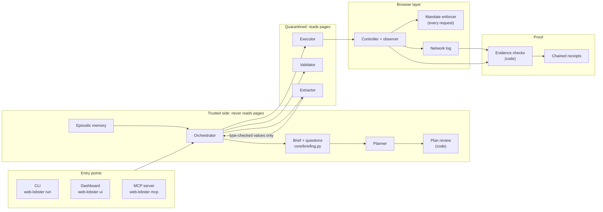
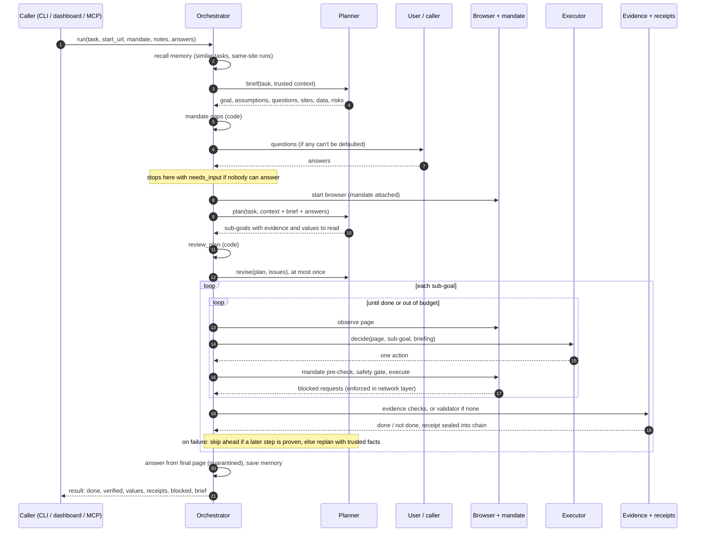
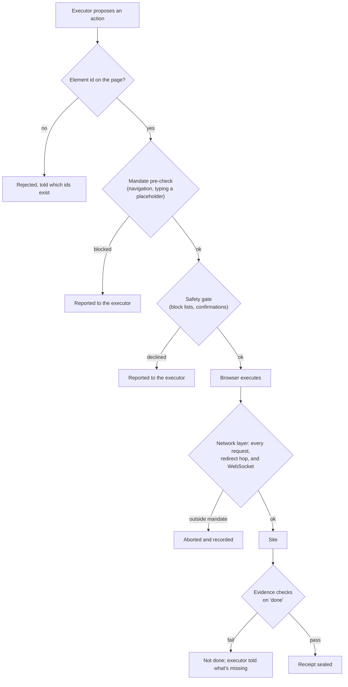

# web-lobster architecture

web-lobster is a web agent built around one idea: **the models are never the security boundary.** A planner decides what to do without ever reading a web page. Quarantined models read pages and pick one browser action at a time. The browser enforces a user-approved mandate on every request, and code, not a model, decides whether each step is done. This document covers how those pieces fit together.

- [The big picture](#the-big-picture)
- [Life of a task](#life-of-a-task)
- [Components](#components)
- [Trust boundaries](#trust-boundaries)
- [Layers of enforcement](#layers-of-enforcement)
- [Data contracts](#data-contracts)
- [Surfaces](#surfaces)
- [Configuration](#configuration)
- [Extending it](#extending-it)
- [Design records](#design-records)

## The big picture

Three rules hold the design together:

1. **Information flows one way across the quarantine line.** Page content reaches the executor, validator, and extractor, but only type-checked values (numbers, dates, booleans, the planner's own choices) flow back to the planner. Text values cross only as a withheld reference.
2. **Permissions are enforced below the models.** The mandate lives in the browser's network layer, so no prompt can widen it.
3. **"Done" is decided by code where possible.** A sub-goal with evidence is done only when its checks pass against the live browser and network log. Without evidence, a model judges it, and the receipt says so.

## Life of a task

Step by step, with the code that does it:

| Stage | What happens | Code |
|---|---|---|
| Entry | CLI, dashboard, or MCP builds a config, an optional mandate, and an `Orchestrator`. MCP requires a mandate | `__main__.py`, `ui/server.py`, `mcp_server/service.py` |
| Recall | Similar past tasks by word overlap, plus recent trusted runs on the mandate's sites and the start origin | `Orchestrator.recall`, `memory/task_memory.py` |
| Think | Build a `PlanningContext`, get a brief, compute mandate gaps, settle questions. May stop with `needs_input` | `Orchestrator.think`, `core/briefing.py`, `Planner.brief` |
| Plan | Sub-goals, each with optional `extract` (values to read) and `evidence` (checks). Small-model mistakes are tidied: guessed search URLs are dropped, and extract and click-level steps are folded into the outcomes they belong to | `Planner.plan`, `tidy_sub_goals` |
| Review | Code checks the plan against the mandate and itself; one revision round | `review_plan`, `Orchestrator._review_plan`, `Planner.revise` |
| Already there? | A sub-goal that only opens a page counts as done when its url check already passes | `Orchestrator._already_there` |
| Act | Observe → executor picks one action → element check → mandate pre-check → safety gate → execute → report what the network layer blocked | `Orchestrator._execute_subgoal`, `browser/`, `models/executor.py` |
| Stuck | Repeated actions trigger a reflection and a retry | `utils/retry.py` `StuckDetector`, `Executor.reflect` |
| Verify | Evidence checks (with a short wait while requests are in flight), or the validator model. Values declared on the sub-goal are read and type-checked | `Orchestrator._verify`, `verify/evidence.py`, `models/extractor.py`, `core/values.py` |
| Seal | A receipt per sub-goal, SHA-256 chained to the previous one | `verify/receipts.py` |
| Recover | Skip ahead if the failed step reached a later step's proven page; otherwise replan from trusted facts | `_skip_to_later_goal`, `_replan` |
| Finish | Answer extracted from the final page (quarantined), learnings written from trusted inputs, memory saved | `_extract_answer`, `_save_to_memory` |

## Components

### Entry points

| Module | Role |
|---|---|
| `__main__.py` | CLI: `run`, `ui`, `bench`, `mcp`. `run` asks the planner's questions at a terminal, or exits with code 2 when it can't |
| `ui/server.py`, `ui/state.py`, `ui/dashboard.html` | FastAPI dashboard. The orchestrator pushes events through `SharedState`, and a WebSocket streams them. Confirmation, login, and questions are futures the browser UI resolves |
| `mcp_server/` | `WebTaskService` (transport-independent logic), `server.py` (MCP tools), `models.py` (tool schemas), `agents.py` (`ServerUI` progress bridge, `ValueRequestingPlanner`) |

### The trusted side

| Module | Role |
|---|---|
| `core/orchestrator.py` | Runs the whole lifecycle and owns the trust boundary: decides what each model may see |
| `core/briefing.py` | `TaskBrief`, `Question`, `PlanningContext` (the only way context reaches the planner), mandate gaps, answer resolution, plan review |
| `models/planner.py` | Brief, plan, revise, replan, and learnings prompts. Tidies plans small models get wrong |
| `core/values.py` | `ValueSpec` and `ExtractedValue`: the typed channel from pages back to the planner |
| `memory/task_memory.py` | Episodic memory. Answers are kept for the user and never shown to the planner. Records carry planner-written sub-goals, per-goal step counts, visited origins, and, for runs that succeeded, the plan itself, which can be offered for reuse on the same site |

### The quarantined side

| Module | Role |
|---|---|
| `models/executor.py` | Picks one action from the page, the sub-goal, recent history, and the task briefing. Uses tool use on Claude, and a JSON grammar on llama.cpp |
| `models/validator.py` | Judges a sub-goal that has no evidence, optionally from a screenshot |
| `models/extractor.py` | Reads declared values from the page's main content, for code to type-check |

### Models

| Module | Role |
|---|---|
| `models/base.py` | The `generate(prompt, system, images, …)` interface |
| `models/ollama_backend.py` | Local models. Honors `context_window`, and falls back to text only when a model rejects images |
| `models/anthropic_backend.py` | Claude, including tool-use action decisions |
| `models/llamacpp_backend.py` | GGUF models with GBNF-constrained output |

Each role (planner, executor, validator) picks its own backend in config. The extractor shares the executor's backend.

### The browser

| Module | Role |
|---|---|
| `browser/controller.py` | Playwright lifecycle, action execution, typing granted data at the last moment, main-content page text |
| `browser/observer.py` | Page state: interactive elements, accessibility tree, DOM summary, screenshots, login detection |
| `browser/annotator.py` | Numbered badges on screenshots so vision models can ground element ids |
| `actions/safety.py`, `actions/registry.py` | Safety gate (confirmation keywords, URL allow/block lists, per-sub-goal action cap) and the action registry |

### Enforcement and proof

| Module | Role |
|---|---|
| `mandate/schema.py` | The mandate: origins, data grants, write rules, expiry, and URL pattern matching |
| `mandate/enforcer.py` | Routes every request and WebSocket through the mandate. Checks each redirect hop, blocks data leaving for ungranted origins, and decides which blocks the executor should hear about |
| `verify/network.py` | What the browser sent and got back, with URLs redacted |
| `verify/evidence.py` | `url`, `request`, `text`, and `value` checks, evaluated in code |
| `verify/receipts.py` | Receipts, the hash chain, and chain verification |

### Measurement

| Module | Role |
|---|---|
| `bench/` | Seven trap sites that log what they receive, scripted hijacked and honest models, five defense setups, and scoring from server logs |
| `trials/` | Live tasks with known answers, run again and again under one or more configs through the MCP service path, and scored in code: done, right, and verified rates, with median steps and time |

## Trust boundaries

Who sees what:

| Information | Planner | Executor | Validator / extractor | Calling agent (MCP) | User |
|---|---|---|---|---|---|
| Task, notes, answers | ✓ | ✓ (briefing) | – | ✓ | ✓ |
| Mandate (data named, never valued) | ✓ | placeholder names | – | ✓ | ✓ |
| Current date and time | ✓ | – | – | – | – |
| Brief (planner-written) | ✓ | goal and assumptions | – | ✓ | ✓ |
| Memory: past plans, step counts, learnings | ✓ | – | – | – | – |
| Start page (origin + path) | brief and plan only | ✓ | ✓ | ✓ | ✓ |
| Page text, elements, screenshots | ✗ | ✓ | ✓ | only with `include_page_text` | ✓ |
| Number, date, boolean, and choice values | ✓ | ✓ | – | ✓ | ✓ |
| Text values | withheld reference | ✓ | – | only with `include_page_text` | ✓ |
| Current origin, failure counts and kinds | replan only | – | – | origins only | ✓ |
| Granted data values | ✗ | ✗ (browser fills them in) | ✗ (redacted) | never returned | ✓ |

`tests/test_planner_isolation.py` plants a canary in a page's text and URL, and asserts that no planner prompt contains it: not the brief, the plan, the replan, the learnings, or the next run's memory.

## Layers of enforcement

Each layer assumes the ones above it can fail. The executor can be fully hijacked, as in the benchmark's worst case, and the network layer still blocks everything the mandate doesn't allow. Evidence still refuses a success banner as proof of success.

## Data contracts

All inter-component data is Pydantic, in `core/schemas.py` unless noted.

| Model | Carries |
|---|---|
| `Action` | One browser action: type, element id, text, URL, reason |
| `Observation` | URL, title, interactive elements, accessibility tree, DOM summary, page text, screenshots, login flag |
| `SubGoal` / `TaskPlan` | Goal, success criteria, status, attempts, `extract` value specs, and `evidence` checks |
| `TaskBrief` / `Question` / `PlanningContext` (`core/briefing.py`) | The brief, typed questions with defaults, and everything the planner may know |
| `ValueSpec` / `ExtractedValue` (`core/values.py`) | A value to read, with an optional shape (`pattern`, `min`, `max`) enforced in code, and the checked result with its origin |
| `Mandate` / `DataGrant` / `WriteRule` (`mandate/schema.py`) | The approved scope |
| `Violation` (`mandate/enforcer.py`) | A blocked request: kind, URL, detail, resource type, main-frame flag |
| `EvidenceCheck` (`verify/evidence.py`) | `url`, `request`, `text`, or `value` checks, and their results |
| `Receipt` (`verify/receipts.py`) | A sub-goal's outcome, basis, checks, writes sent, page, and chain digest |
| `AgentResult` (`core/orchestrator.py`) | Everything a run produced, including the brief, answers, and whether it needs input |

## Surfaces

**CLI.** The main flags are:

- `web-lobster run TASK`: `-c` config, `-m` mandate, `-u` start URL, `--receipts`, `--notes`, `--answer ID=VALUE`, `--assume`, `--no-brief`, `--max-steps`, `--dry-run`.
- `web-lobster bench`: `--mode scripted|live`, `--scenario`, `--defenses`.
- `web-lobster trials FILE`: `-c` (repeat to compare configs), `-n` runs, `--task`, `--memory fresh|shared`, `--json`, `--markdown`.
- `web-lobster mcp`: `--transport stdio|streamable-http`, `--runs-dir`, `--approve-confirmations`.
- `web-lobster ui`.

**Dashboard events.** `task_start`, `brief`, `questions_request`, `plan_ready`, `plan_review`, `subgoal_start`, `observation`, `action`, `validation`, `receipt`, `safety_flag`, `confirm_request`, `login_required`, `task_complete`. Answers go to `POST /api/agent/answers`.

**MCP tools:**

| Tool | What it does |
|---|---|
| `brief_task` | Thinks without a browser |
| `web_task` | Runs a task, or returns `needs_input` |
| `check_mandate` | Validates a mandate and returns approval text |
| `get_run` | Returns a saved run, with page text only on request |
| `verify_receipts` | Checks a run's receipt chain |

The details are in [mcp-server.md](mcp-server.md).

## Configuration

`core/config.py`, loaded from YAML (`configs/`):

| Section | Controls |
|---|---|
| `planner`, `executor`, `validator` | Backend, model, temperature, token and context limits, vision on or off |
| `browser` | Headless, viewport, timeouts |
| `safety` | Dry run, confirmation keywords, URL allow and block lists, actions per sub-goal, ensemble voting |
| `agent` | Step and replan budgets, validation threshold, DOM mode, wall-clock limit, evidence wait, and, for thinking first, `briefing`, `questions`, `plan_review`, `max_sub_goals`, `notes_file`, `reuse_plans` |
| `mcp_servers` | MCP tools the agent itself may call. These are turned off under a mandate |

## Extending it

- **A model backend:** implement `generate` from `models/base.py`, then add it to `Orchestrator._create_backend`.
- **An evidence check:** add a model to the `EvidenceCheck` union and a branch to `evaluate` in `verify/evidence.py`, then mention it in the planner prompt.
- **A value type:** extend `ValueType` and `coerce_value` in `core/values.py`. The type decides whether the planner may see the value.
- **A plan-review rule:** add it to `review_plan` in `core/briefing.py`. Rules may only read the plan and the mandate.
- **A benchmark scenario:** add routes, a script, and ground-truth checks in `bench/scenarios.py`.

## Design records

- [roadmap.md](roadmap.md): where the project is going, and the known gaps.
- [design/step-5-mcp-server.md](design/step-5-mcp-server.md): serving other agents.
- [design/step-6-planner-briefing.md](design/step-6-planner-briefing.md): thinking before acting.
- [live-testing.md](live-testing.md): what broke on live sites, and what was fixed.
